title: Monaca × ニフクラ mobile backendで簡単アプリ開発入門！
title_row1: Monaca × ニフクラ mobile backendで
title_row2: 簡単アプリ開発入門！
company_ja: 富士通クラウドテクノロジーズ株式会社
company_en: FUJITSU CLOUD TECHNOLOGIES LIMITED
thisyear: 2019
class: animation-fade
layout: true

<!-- This slide will serve as the base layout for all your slides -->
.bottom-bar[
  .small[
  .center[Copyright 2017 - {{thisyear}} FUJITSU CLOUD TECHNOLOGIES LIMITED]
  ]
]

---

class: impact

# {{title_row1}}
# {{title_row2}}

.footer[
    {{company_ja}}
]

---

class: impact

## 目次

---

## 目次

- [はじめに(使用するツール／対象者／作成物等の説明)]()
- [アカウントの登録]()
- [Monacaの使い方 + Hello world]()
- [mobile backend上のアプリ作成+SDKの組み込み]()
- [データストアにデータを書き込んでみよう]()
- [データストアのデータを取得してみよう]()
- [メモアプリを作ろう1(作成物の内容を知る)]()
- [メモアプリを作ろう2(UIを作る)]()
- [メモアプリを作ろう3(書き込み処理を作る)]()
- [メモアプリを作ろう4(取得処理を作る)]()
- [まとめ]()

---

class: impact

## #1 はじめに
### 使用するツール／対象者／作成物等の説明

---

# 自己紹介

.col-6[
  ## 佐々木 大樹
  ### 所属
  富士通クラウドテクノロジーズ株式会社
  ### 業務
  ニフクラ mobile backend 企画／営業
]

.col-6[
  
]

---

# ニフクラ mobile backendとは

.center[
  

  https://mbaas.nifcloud.com/
]

---

# Monacaとは

---

# ニフクラ mobile backend × Monaca

.center[]

---

# Monacaユーザーに最も支持されるクラウド

ニフクラ mobile backendは、プッシュ通知、mBaaSの2部門で、MonacaユーザーNo.1の支持を獲得しました！

.center[
  .col-6[
    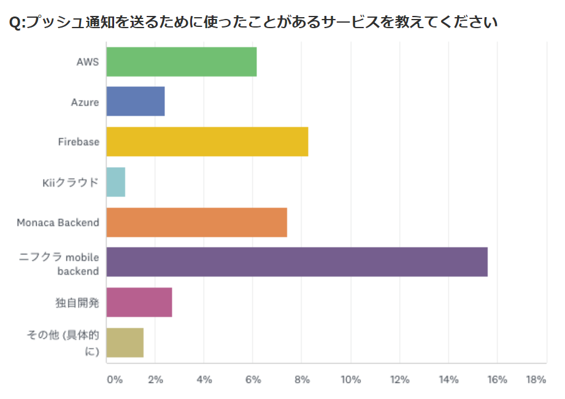
  ]
  .col-6[
    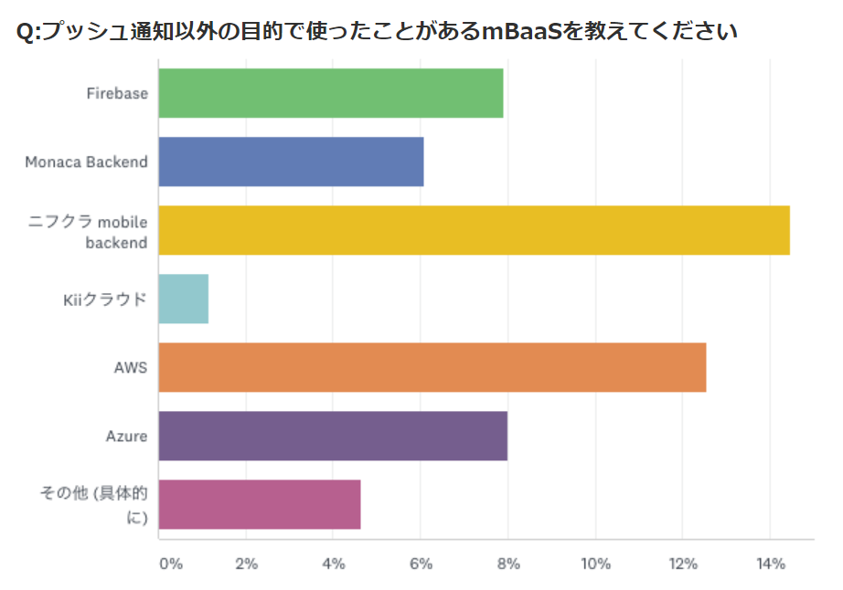
  ]
]

.col-6[※出典：https://press.monaca.io/ryo/2001]

---

# 本コンテンツの対象者

## 必要スキル

- HTML / JavaScriptの基本的な知識

## 必要な環境

- 最新のGoogle ChromeがインストールされたMac / Windows

---

# 作成物

メモアプリの説明

---

class: impact

## #2 アカウントの登録

---

# ニフクラ mobile backendの準備

## アプリの作成

mobile backendの管理画面( https://console.nifcloud.com/ )にログインして、以下の手順でアプリを作成します。

.center[
  .col-6[
    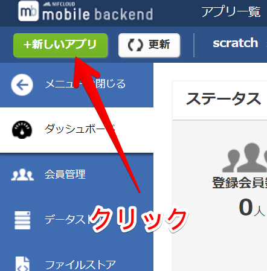
  ]
  .col-6[
    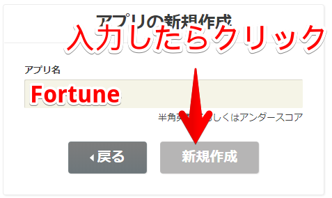
  ]
]

---

# ニフクラ mobile backendの準備

この画面が表示されます。  
これでmobile backendの準備は完了です。タブはこのままにしておき、新しいタブを開いて次のステップへ進みます。

.center[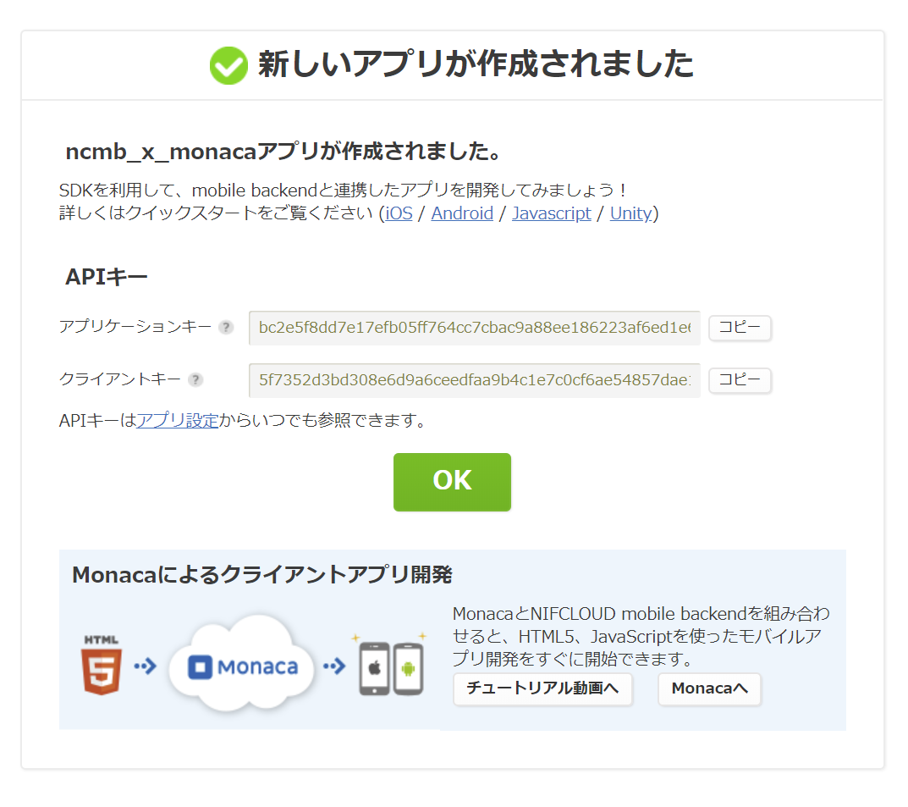]

---

# Monacaの準備

## プロジェクトの作成

Monacaダッシュボード(要ログイン)から、以下の手順でプロジェクトを作成します。

.col-4[
  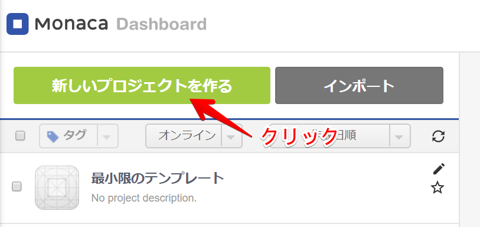
]
.col-4[
  
]
.col-4[
  
]

作成されたら、作成したプロジェクトをクリックして「クラウドIDEで開く」を押してください。

---

#  Monacaの準備

この画面が表示されます。  
これで準備は完了です。開いたタブはそのままにしておきましょう。

.center[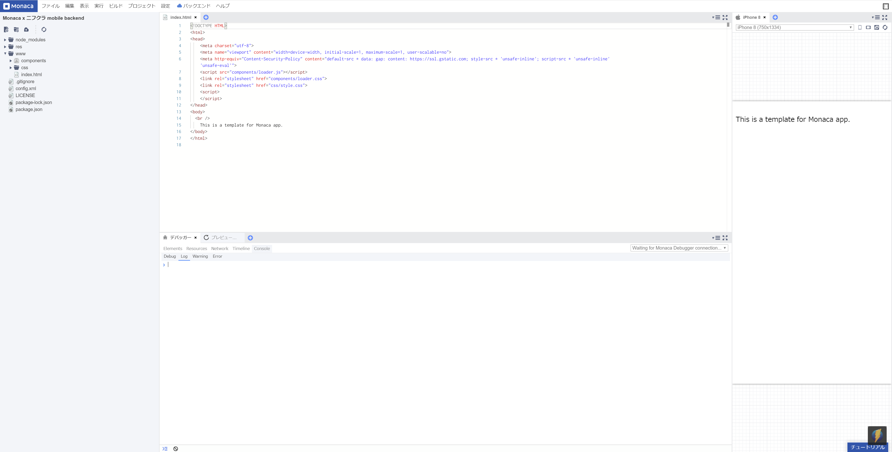]

---

class: impact

## Monaca × ニフクラ mobile backendの連携

---

# Monacaとmobile backendの連携

## SDKの導入①

以下手順でmobile backendのJavaScript SDKの導入します。

.center[
  .col-6[
    
  ]
  .col-6[
    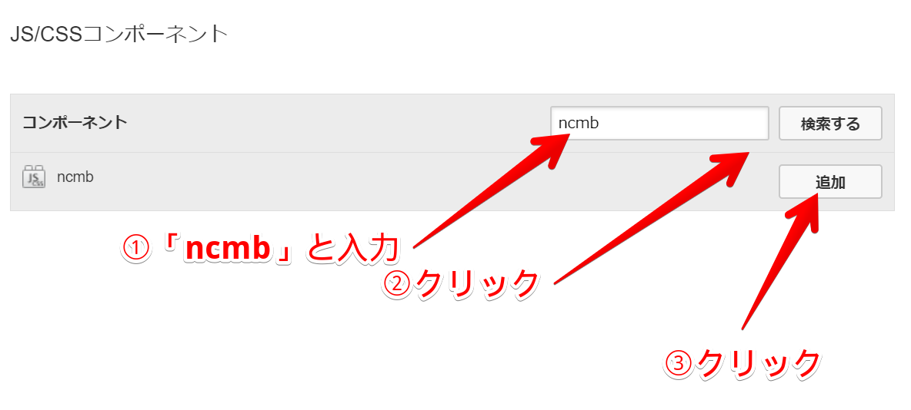
  ]
]

---

# Monacaとmobile backendの連携

## SDKの導入②

以下手順でmobile backendのJavaScript SDKの導入します。

.center[
  .col-6[
    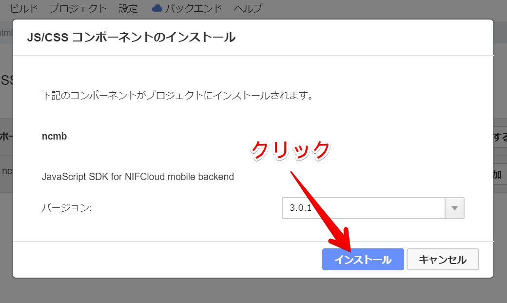
  ]
  .col-6[
    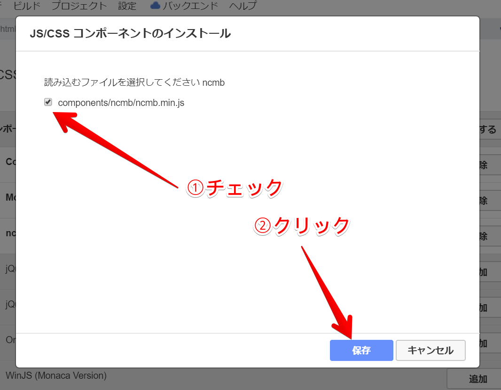
  ]
]

---

# Monacaとmobile backendの連携

## APIキーの入力①

Monaca上のindex.htmlの10, 11行目にある以下部分を書き換えてmobile backend上のアプリへつなぎ込みを行います。


```html
<script>
</script>
```

以下のように書き換えましょう。

```html
<script>
  var APPLICATION_KEY = 'アプリケーションキー'; // アプリケーションキーの設定
  var CLIENT_KEY = 'クライアントキー'; // クライアントキーの設定
  var ncmb = new NCMB(APPLICATION_KEY, CLIENT_KEY); // SDKの初期化処理
</script>
```

上記コードの'アプリケーションキー'、'クライアントキー'の部分に、mobile backend上の一つ一つのアプリ固有のキーを入力することにより、mobile backend上のどのアプリと連携するのかが決まります。

---

# Monacaとmobile backendの連携

.col-6[

  ## APIキーの入力②

  mobile backendのタブに戻り、画面に表示されている「アプリケーションキー」「クライアントキー」をそれぞれコード上の'アプリケーションキー'、'クライアントキー'の部分に置き換える形で入力します。

  コピペミスを防ぐため、キーの右側にある「コピーボタン」を押すと確実です。

  また、すでに「OK」を押して画面を閉じてしまった場合は、画面右上の「アプリ設定」をクリックすると、中段にある「APIキー」の欄で同様の情報をご確認いただけます。

  なお、APIキーは重要な情報なので、第三者に知られることのないようにしましょう。

]

.center[]

---

class: impact

## mobile backendへのデータの登録

---

# mobile backendへのデータの登録

## データストアを使う①

mobile bacnekdに画面で、データストア(データベース)機能を使いましょう。  
左側メニューの「データストア」をクリックし、新しいクラス(データストアの単位)を作成します。

.center[
  .col-6[
    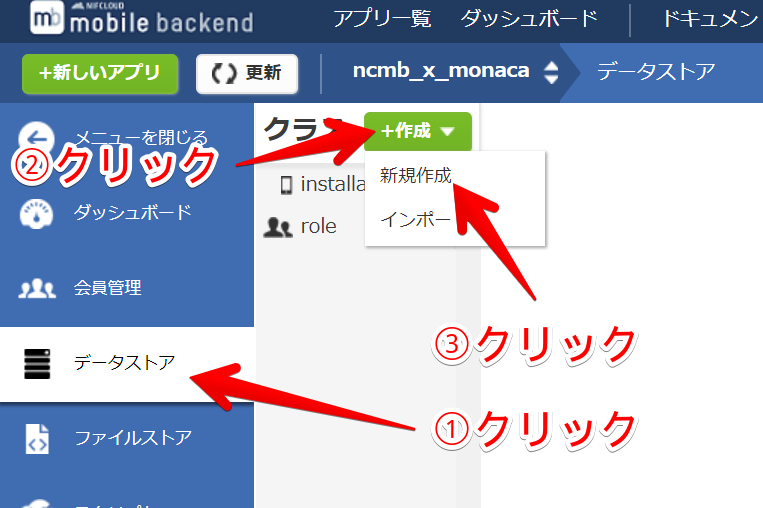
  ]
  .col-6[
    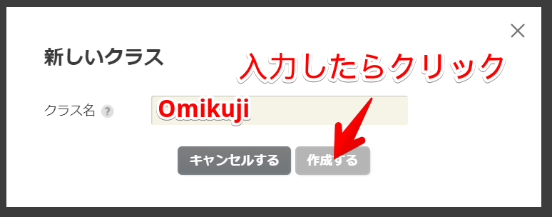
  ]
]

---

# mobile backendへのデータの登録

## データストアを使う②

クラスが作成され、この画面が表示されます。

.center[
  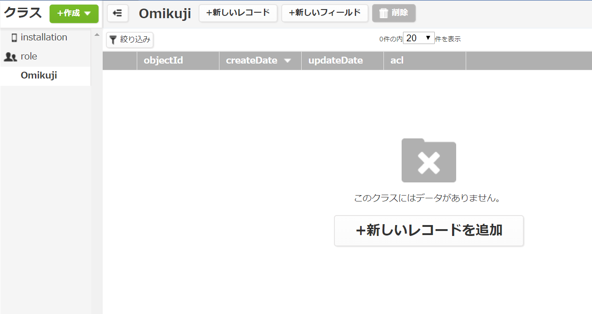
]

---

# mobile backendへのデータの登録

## データストアを使う③

「＋新しいフィールド」をクリックし、おみくじの結果を格納するフィールド(列)「result」を追加します。

.center[
  .col-6[
    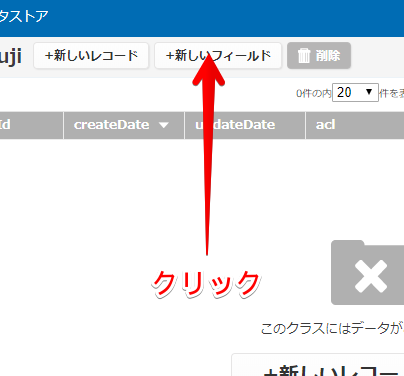
  ]
  .col-6[
    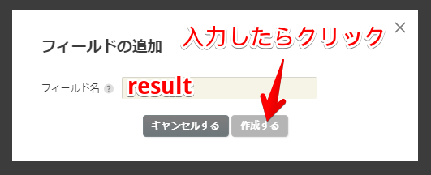
  ]
]

---

# mobile backendへのデータの登録

## データストアを使う④

次に、「＋新しいレコード」をクリックし、実際にデータ(おみくじの結果)を作っていきます。  
大吉が作成できたら、同じように「中吉」「小吉」「吉」「凶」「大凶」などなど入れてみましょう。

.center[
  .col-6[
    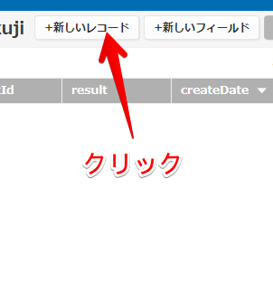
  ]
  .col-6[
    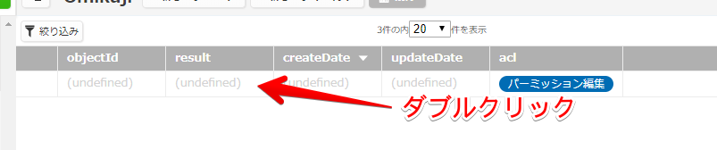
    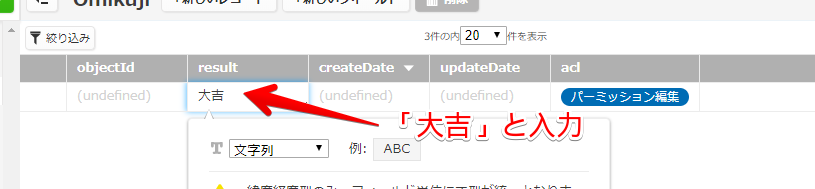
  ]
]

---

class: impact

## mobile backendからデータを取得する

---

# mobile backendからデータを取得する

## 画面を作る

Monacaのタブを開き、index.htmlの16行目から始まるbodyタグの中身を以下記述に置き換えます。

```html
<body>
	<br />
    This is a template for Monaca app.
</body>
```

こちらを以下に置き換えます。

```html
<body>
  <button onclick="omikuji();">おみくじを引く</button>
  結果：<span id="result"></span>
</body>
```

ボタンが押されると、omikuji()という関数が呼ばれます。  
まだ処理を実装していないので、現時点ではクリックしても何も起こりません。

---

# mobile backendからデータを取得する

## 取得処理の実装①

では、先程配置したボタンが押されたときにおみくじを引く処理を実装していきます。  
10行目からのscriptタグの中に、以下を追記します。

```js
function omikuji() { // おみくじボタン押下時の処理
  var Omikuji = ncmb.DataStore('Omikuji'); // 取得元クラスの生成
  // 取得処理
  Omikuji.fetchAll()
    .then(function(objects){
      var random = Math.floor(Math.random()*objects.length); // データ数内で乱数を作成
      var object = objects[random]; // 乱数番目のデータ
      var result= object.get('result'); // 「result」フィールドの値を取得
      document.getElementById('result').innerText = result; // 画面に結果を表示
      })
    .catch(function(error){
      /* 取得失敗時の処理 */
      alert('Error: ' + error.code);
    });
}
```

---

# mobile backendからデータを取得する

## 取得処理の実装②

```js
var Omikuji = ncmb.DataStore('Omikuji'); // 取得元クラスの生成
```

データストア上のOmikujiクラスを参照するためのクラスOmikujiを作成します。

```js
Omikuji.fetchAll()
  .then(function(objects){
    var random = Math.floor(Math.random()*objects.length); // データ数内で乱数を作成
    var object = objects[random]; // 乱数番目のデータ
    var result= object.get('result'); // 「result」フィールドの値を取得
    document.getElementById('result').innerText = result; // 画面に結果を表示
  })
```

そして、Omikujiクラスのデータを配列型で一気に取得します。※デフォルトで100件取得します。  
0から配列に格納されているメンバの数(objects.length)-1までのいずれかの整数をランダムに生成します。  
そしてそれを変数resultに格納し、最後にDOMを使って画面に描画します。

---

# mobile backendからデータを取得する

## 取得処理の実装③

```js
.catch(function(error){
  /* 取得失敗時の処理 */
  alert('Error: ' + error.code);
});
```

さいごに、何らかの失敗をした場合のために、catchでエラーを出力するようにしています。

---

# mobile backendからデータを取得する

scriptタグ全体としては、以下のようになります。

```html
<script>
  var APPLICATION_KEY = 'アプリケーションキー'; // アプリケーションキーの設定
  var CLIENT_KEY = 'クライアントキー'; // クライアントキーの設定
  var ncmb = new NCMB(APPLICATION_KEY, CLIENT_KEY); // SDKの初期化処理

  function omikuji() { // おみくじボタン押下時の処理
    var Omikuji = ncmb.DataStore('Omikuji'); // 取得元クラスの生成
    // 取得処理
    Omikuji.fetchAll()
      .then(function(objects){
        var random = Math.floor(Math.random()*objects.length); // データ数内で乱数を作成
        var object = objects[random]; // 乱数番目のデータ
        var result= object.get('result'); // 「result」フィールドの値を取得
        document.getElementById('result').innerText = result; // 画面に結果を表示
      })
      .catch(function(error){
        /* 取得失敗時の処理 */
        alert('Error: ' + error.code);
      });
  }
</script>
```
---

class: impact

## 完成！

---

# プレビュー画面で触ってみる

「おみくじを引く」ボタンを押すことで、無事運勢が表示されます。  
何度もクリックすると、また違った運勢が表示されます。  
これで、無事クラウドと連携できたことが分かるかと思います。

.center[
  .col-6[
    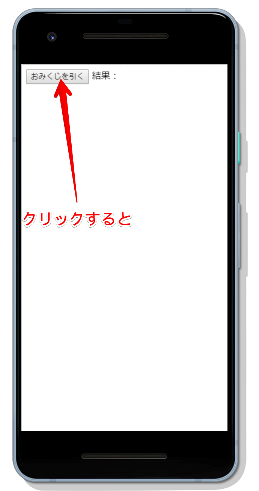
  ]
  .col-6[
    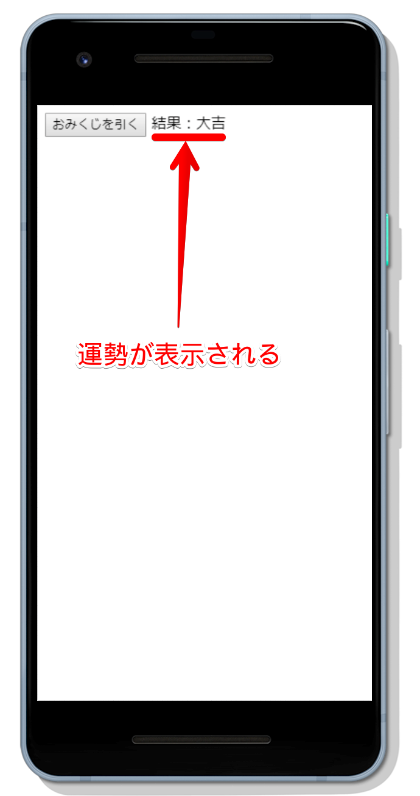
  ]
]

---

# まとめ

--

## クラウドを使って、アプリ開発をより簡単に！

- ニフクラ mobile backendを使えば、自前で構築すると複雑になりがちなバックエンド側の処理をより簡単に開発可能！
- その分浮いたリソースをユーザーが直接触るフロントエンドに回すことで、よりリッチなアプリを開発！
- Monaca以外にも、Swift, Objective-C, Java, Unity(C#)などに対応！

--

## データストア以外にも豊富な機能！

- 今回はデータストアを体験いただきましたが、データストア以外にもプッシュ通知／ユーザー認証／ファイルストア(ストレージ)など、開発を助ける機能が盛りだくさん！
- 詳しくは是非ドキュメントをご覧ください！
  https://mbaas.nifcloud.com/doc/current/

--

.center[
  .big[ご清聴ありがとうございました！]
]